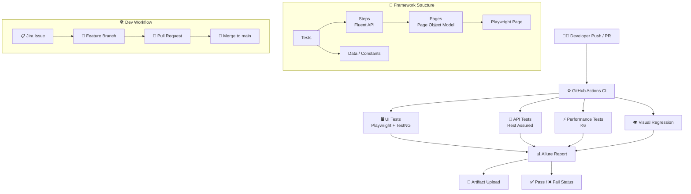
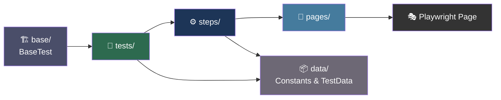

<a id="readme-top"></a>

<!-- PROJECT SHIELDS -->
<div align="center">

[![Contributors][contributors-shield]][contributors-url]
[![Forks][forks-shield]][forks-url]
[![Stars][stars-shield]][stars-url]
[![Issues][issues-shield]][issues-url]
[![MIT License][license-shield]][license-url]
[![CI/CD][cicd-shield]][cicd-url]

</div>

<!-- PROJECT LOGO / HEADER -->
<br />
<div align="center">
  <h1>🏦 TBC Bank — End-to-End Test Automation Suite</h1>
  <p align="center">
    A full-cycle QA automation project covering UI, API, Visual Regression & Performance testing for <strong>tbcbank.ge</strong>
    <br />
    Built during <strong>TBC Bootcamp 2025.3</strong> · Team 1 · Agile workflow · 15,000+ lines of code
    <br /><br />
    <a href="https://github.com/NikolozZhordania/Bootcamp2025.3_Team1"><strong>📂 Explore the Repo »</strong></a>
    &nbsp;·&nbsp;
    <a href="https://github.com/NikolozZhordania/Bootcamp2025.3_Team1/issues">🐛 Report Bug</a>
    &nbsp;·&nbsp;
    <a href="https://github.com/NikolozZhordania/Bootcamp2025.3_Team1/issues">✨ Request Feature</a>
  </p>
</div>

---

<!-- TABLE OF CONTENTS -->
<details>
  <summary>📋 Table of Contents</summary>
  <ol>
    <li><a href="#about-the-project">About The Project</a></li>
    <li><a href="#team">Team</a></li>
    <li><a href="#feature-coverage">Feature Coverage</a></li>
    <li><a href="#tech-stack">Tech Stack</a></li>
    <li><a href="#repository-structure">Repository Structure</a></li>
    <li><a href="#test-scenarios">Test Scenarios</a></li>
    <li><a href="#getting-started">Getting Started</a>
      <ul>
        <li><a href="#prerequisites">Prerequisites</a></li>
        <li><a href="#installation">Installation</a></li>
        <li><a href="#running-tests">Running Tests</a></li>
      </ul>
    </li>
    <li><a href="#cicd">CI/CD</a></li>
    <li><a href="#ai-assisted-quality-engineering">AI-Assisted Quality Engineering</a></li>
    <li><a href="#bug-report">Bug Report</a></li>
    <li><a href="#contributing">Contributing</a></li>
  </ol>
</details>

---

## About The Project

This project is the **final deliverable** of TBC Bootcamp 2025.3 — a complete, production-grade automation workflow targeting the **Locations & ATMs** feature of [tbcbank.ge](https://tbcbank.ge).

The team operated in a **real Agile environment**: daily standups on Discord, sprint planning on Jira, feature branches with pull requests into `main`, and automated CI/CD pipelines ensuring every merge was validated automatically.

**What makes this project stand out:**

- 🧪 **15,000+ lines** of clean, maintainable test automation code
- 🔄 Runs successfully in **headed, headless, and CI/CD** modes
- 🤖 Incorporates **AI-assisted quality engineering** as part of the workflow
- 📊 Full **Allure reporting** with screenshots, logs, and parallel execution
- 🌐 Covers **UI + API + Visual Regression + Performance** — true end-to-end QA ownership

<p align="right">(<a href="#readme-top">back to top</a>)</p>

---

## Team

<div align="center">
<table>
  <tr>
    <td align="center" width="160">
      <br/>
      <b>Nikoloz Zhordania</b><br/>
      <a href="https://github.com/NikolozZhordania">@NikolozZhordania</a><br/>
      <sub>👑 Team Captain<br/>Setup & CI/CD</sub>
    </td>
    <td align="center" width="160">
      <br/>
      <b>Lekso Meshveliani</b><br/>
      <a href="https://github.com/LexoMeshveliani">@LexoMeshveliani</a><br/>
      <sub>📋 Scenarios<br/>& Bug Reporting</sub>
    </td>
    <td align="center" width="160">
      <br/>
      <b>Nika Butbaia</b><br/>
      <a href="https://github.com/NikaButbaia">@NikaButbaia</a><br/>
      <sub>🖥️ UI Automation</sub>
    </td>
  </tr>
  <tr>
    <td align="center" width="160">
      <br/>
      <b>Mariam Arsenidze</b><br/>
      <a href="https://github.com/mariamarsenidze">@mariamarsenidze</a><br/>
      <sub>🖥️ UI Automation</sub>
    </td>
    <td align="center" width="160">
      <br/>
      <b>Nikoloz Chixladze</b><br/>
      <sub>🔌 API &<br/>Performance Tests</sub>
    </td>
    <td align="center" width="160">
      <br/>
      <b>Jimusi Axubaria</b><br/>
      <sub>🤖 AI Task<br/>& Presentation</sub>
    </td>
  </tr>
</table>
</div>

<br/>

<div align="center">

| 💬 Discord | 📋 Jira | 🌿 GitHub |
|:---:|:---:|:---:|
| Daily standups & pair programming calls | Sprint planning, issue tracking, task distribution | Feature branches → Pull Requests → `main` |

</div>

<p align="right">(<a href="#readme-top">back to top</a>)</p>

---

## Feature Coverage

This team was assigned **Team 1 – Locations & ATMs** on [tbcbank.ge](https://tbcbank.ge).

<div align="center">

<table>
  <tr>
    <td align="center" width="200">
      <h3>🖥️ UI</h3>
      <sub>
        Homepage access<br/>
        Navigation menu<br/>
        Locations page<br/>
        Branch & ATM filters<br/>
        Working hours calendar<br/>
        Edge case inputs
      </sub>
    </td>
    <td align="center" width="200">
      <h3>🔌 API</h3>
      <sub>
        Offers endpoint structure<br/>
        Date integrity checks<br/>
        Expiration validation<br/>
        Countdown value integrity
      </sub>
    </td>
    <td align="center" width="200">
      <h3>⚡ Performance</h3>
      <sub>
        K6 load testing<br/>
        Key user flow stress tests<br/>
        Response time thresholds
      </sub>
    </td>
    <td align="center" width="200">
      <h3>👁️ Visual Regression</h3>
      <sub>
        Screenshot comparisons<br/>
        Layout consistency checks<br/>
        Cross-run diff detection
      </sub>
    </td>
  </tr>
</table>

</div>

<p align="right">(<a href="#readme-top">back to top</a>)</p>

---

## Tech Stack

<div align="center">

[![Java][java-shield]][java-url]
[![Maven][maven-shield]][maven-url]
[![Playwright][playwright-shield]][playwright-url]
[![TestNG][testng-shield]][testng-url]
[![RestAssured][restassured-shield]][restassured-url]
[![K6][k6-shield]][k6-url]
[![Allure][allure-shield]][allure-url]
[![GitHub Actions][actions-shield]][actions-url]
[![Jira][jira-shield]][jira-url]

</div>

<br/>

<div align="center">
<table>
  <tr>
    <th>🧩 Layer</th>
    <th>🔧 Tool</th>
    <th>📝 Purpose</th>
  </tr>
  <tr>
    <td rowspan="2"><b>Testing</b></td>
    <td>Playwright (Java)</td>
    <td>UI automation — cross-browser, headed & headless</td>
  </tr>
  <tr>
    <td>TestNG</td>
    <td>Test runner — parallel execution, dependency chains</td>
  </tr>
  <tr>
    <td><b>API</b></td>
    <td>Rest Assured</td>
    <td>API testing — request/response validation</td>
  </tr>
  <tr>
    <td><b>Performance</b></td>
    <td>K6</td>
    <td>Load & stress testing scenarios</td>
  </tr>
  <tr>
    <td><b>Reporting</b></td>
    <td>Allure</td>
    <td>Screenshots, logs, history trends</td>
  </tr>
  <tr>
    <td><b>CI/CD</b></td>
    <td>GitHub Actions</td>
    <td>Automated test runs on every push / PR</td>
  </tr>
  <tr>
    <td><b>Project Mgmt</b></td>
    <td>Jira</td>
    <td>Issues, sprints, task tracking</td>
  </tr>
  <tr>
    <td><b>Build</b></td>
    <td>Maven</td>
    <td>Dependency management & build lifecycle</td>
  </tr>
</table>
</div>

<br/>

### 🏗️ Architecture Overview



<p align="right">(<a href="#readme-top">back to top</a>)</p>

---

## Repository Structure

```
Bootcamp2025.3_Team1/
│
├── 📁 .github/
│   └── workflows/              # GitHub Actions CI/CD pipelines
│
├── 📁 src/main/java/ge/tbc/testautomation/tbcbankapp/
│   ├── 📂 base/                # BaseTest — browser setup & teardown
│   ├── 📂 data/                # Constants, test data, URLs
│   ├── 📂 pages/               # Page Objects — locators & raw Playwright
│   ├── 📂 steps/               # Step classes — fluent business-level actions
│   ├── 📂 tests/               # Test classes — UI, API, Performance
│   └── 📂 utils/               # Helpers & shared utilities
│
├── 📁 ai/
│   ├── prompt.txt              # AI prompt used for code review
│   ├── result.txt              # Raw AI-generated output
│   └── analysis.md             # Team evaluation of AI quality
│
├── 📁 bug-report/              # Real bugs found on tbcbank.ge
├── 📁 zephyr/                  # Zephyr Scale scenario exports
├── 📁 allure-results/          # Generated Allure report data
│
├── README.md
└── pom.xml
```

### 📦 Package Architecture



> **Rule:** No locators in steps/tests. No business logic in pages. All values from `data/`.

<p align="right">(<a href="#readme-top">back to top</a>)</p>

---

## Test Scenarios

The team designed and automated scenarios across all testing layers, following proper positive / negative / edge-case structure as required by Zephyr Scale.

**Sample Scenario Overview (Locations Feature):**

| ID | Scenario | Type | Status |
|----|----------|------|--------|
| DEV-T1 | Homepage loads and nav menu is visible | Positive | ✅ Automated |
| DEV-T2 | Navigation dropdown shows Locations option | Positive | ✅ Automated |
| DEV-T3 | Locations page loads with correct URL and header | Positive | ✅ Automated |
| DEV-T4 | Branch calendar groups by working hours correctly | Positive | ✅ Automated |
| SCRUM-T8 | Whitespace input in ATM search returns unchanged list | Edge Case | ✅ Automated |
| SCRUM-T16 | Offers API: valid structure, date integrity, no expired offers | API | ✅ Automated |

> Full scenario export available in `/zephyr/`

<p align="right">(<a href="#readme-top">back to top</a>)</p>

---

## Getting Started

### Prerequisites

- Java 17+
- Maven 3.8+
- Node.js (for K6 performance tests)
- Allure CLI (for report generation)

```sh
# Install Allure CLI (macOS)
brew install allure

# Install K6 (macOS)
brew install k6

# Install Playwright browsers
mvn exec:java -e -D exec.mainClass=com.microsoft.playwright.CLI -D exec.args="install"
```

### Installation

1. Clone the repository:

```sh
git clone https://github.com/NikolozZhordania/Bootcamp2025.3_Team1.git
cd Bootcamp2025.3_Team1
```

2. Install Maven dependencies:

```sh
mvn clean install -DskipTests
```

### Running Tests

**Run all UI tests (headed):**
```sh
mvn test -Dtest=CalendarTest,LocationsTest
```

**Run all UI tests (headless):**
```sh
mvn test -Dheadless=true
```

**Run API tests:**
```sh
mvn test -Dtest=OffersDataIntegrityTest
```

**Run performance tests:**
```sh
k6 run tests/performance/locations-load-test.js
```

**Run full suite in parallel:**
```sh
mvn test -Dthreads=4
```

**Generate Allure report:**
```sh
allure serve allure-results
```

<p align="right">(<a href="#readme-top">back to top</a>)</p>

---

## CI/CD

All tests are integrated with **GitHub Actions** and run automatically on every push and pull request to `main`.

[](https://github.com/NikolozZhordania/Bootcamp2025.3_Team1/actions)

**Pipeline includes:**
- ✅ Headless UI test execution
- ✅ API test execution
- ✅ Allure report generation & artifact upload
- ✅ Parallel test execution
- ✅ Failure notifications

Pipeline configuration: `.github/workflows/ci.yml`

<p align="right">(<a href="#readme-top">back to top</a>)</p>

---

## AI-Assisted Quality Engineering

The team leveraged AI as part of the quality engineering workflow. Our AI task focused on **AI code review** — feeding Playwright test code to a large language model and evaluating the output.

**Prompt used (excerpt from `/ai/prompt.txt`):**
```
You are a senior test automation engineer. Review this Playwright test:
- Find flakiness risks
- Suggest better locators
- Improve assertions
- Suggest overall improvements
```

**Deliverables:**

| File | Description |
|------|-------------|
| `ai/prompt.txt` | Full prompt submitted to the AI model |
| `ai/result.txt` | Raw AI-generated output |
| `ai/analysis.md` | Team's critical evaluation of AI output quality |

<p align="right">(<a href="#readme-top">back to top</a>)</p>

---

## Bug Report

The team identified and documented a real bug found on tbcbank.ge during exploratory testing.

**Bug Title:** Calculation proceeds with empty input field

| Field | Detail |
|-------|--------|
| **Steps** | 1. Open the page · 2. Leave amount field empty · 3. Click Calculate |
| **Expected** | Validation message is displayed |
| **Actual** | Calculation proceeds without validation |
| **Severity** | Medium |
| **Evidence** | Screenshots available in `/bug-report/` |

> Full bug reports with screenshots are in the `/bug-report/` directory.

<p align="right">(<a href="#readme-top">back to top</a>)</p>

---

## Contributing

This project was built collaboratively using a **trunk-based development** approach:

1. Each team member picks up an issue from the GitHub Project Board
2. Create a feature branch: `git checkout -b feature/your-feature-name`
3. Commit changes with clear messages: `git commit -m 'Add: describe your change'`
4. Push the branch: `git push origin feature/your-feature-name`
5. Open a **Pull Request** targeting `main` — the team reviews before merging

[](https://github.com/NikolozZhordania/Bootcamp2025.3_Team1/graphs/contributors)

<p align="right">(<a href="#readme-top">back to top</a>)</p>

---

<!-- MARKDOWN LINKS & BADGES -->
[contributors-shield]: https://img.shields.io/github/contributors/NikolozZhordania/Bootcamp2025.3_Team1.svg?style=for-the-badge
[contributors-url]: https://github.com/NikolozZhordania/Bootcamp2025.3_Team1/graphs/contributors
[forks-shield]: https://img.shields.io/github/forks/NikolozZhordania/Bootcamp2025.3_Team1.svg?style=for-the-badge
[forks-url]: https://github.com/NikolozZhordania/Bootcamp2025.3_Team1/network/members
[stars-shield]: https://img.shields.io/github/stars/NikolozZhordania/Bootcamp2025.3_Team1.svg?style=for-the-badge
[stars-url]: https://github.com/NikolozZhordania/Bootcamp2025.3_Team1/stargazers
[issues-shield]: https://img.shields.io/github/issues/NikolozZhordania/Bootcamp2025.3_Team1.svg?style=for-the-badge
[issues-url]: https://github.com/NikolozZhordania/Bootcamp2025.3_Team1/issues
[license-shield]: https://img.shields.io/github/license/NikolozZhordania/Bootcamp2025.3_Team1.svg?style=for-the-badge
[license-url]: https://github.com/NikolozZhordania/Bootcamp2025.3_Team1/blob/main/LICENSE
[cicd-shield]: https://img.shields.io/badge/CI%2FCD-GitHub%20Actions-2088FF?style=for-the-badge&logo=githubactions&logoColor=white
[cicd-url]: https://github.com/NikolozZhordania/Bootcamp2025.3_Team1/actions

[java-shield]: https://img.shields.io/badge/Java-17-ED8B00?style=for-the-badge&logo=openjdk&logoColor=white
[java-url]: https://openjdk.org/
[maven-shield]: https://img.shields.io/badge/Maven-C71A36?style=for-the-badge&logo=apachemaven&logoColor=white
[maven-url]: https://maven.apache.org/
[playwright-shield]: https://img.shields.io/badge/Playwright-45ba4b?style=for-the-badge&logo=playwright&logoColor=white
[playwright-url]: https://playwright.dev/
[testng-shield]: https://img.shields.io/badge/TestNG-FF7300?style=for-the-badge&logo=testng&logoColor=white
[testng-url]: https://testng.org/
[restassured-shield]: https://img.shields.io/badge/Rest%20Assured-4DB33D?style=for-the-badge&logo=java&logoColor=white
[restassured-url]: https://rest-assured.io/
[k6-shield]: https://img.shields.io/badge/K6-7D64FF?style=for-the-badge&logo=k6&logoColor=white
[k6-url]: https://k6.io/
[allure-shield]: https://img.shields.io/badge/Allure-FF6B35?style=for-the-badge&logo=qase&logoColor=white
[allure-url]: https://allurereport.org/
[actions-shield]: https://img.shields.io/badge/GitHub%20Actions-2088FF?style=for-the-badge&logo=githubactions&logoColor=white
[actions-url]: https://github.com/features/actions
[jira-shield]: https://img.shields.io/badge/Jira-0052CC?style=for-the-badge&logo=jira&logoColor=white
[jira-url]: https://www.atlassian.com/software/jira